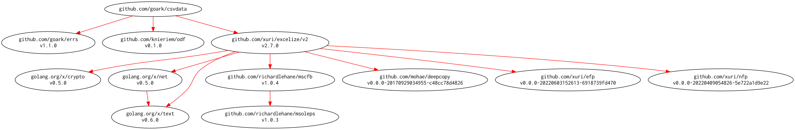

# [csvdata] -- Reading CSV Data

[](https://github.com/spiegel-im-spiegel/csvdata/actions)
[](https://github.com/spiegel-im-spiegel/csvdata/actions)
[](https://raw.githubusercontent.com/spiegel-im-spiegel/csvdata/master/LICENSE)
[](https://github.com/spiegel-im-spiegel/csvdata/releases/latest)

This package is required Go 1.16 or later.

## Import

```go
import "github.com/spiegel-im-spiegel/csvdata"
```

## Usage

```go
// +build run

package main

import (
	_ "embed"
	"errors"
	"fmt"
	"io"
	"os"
	"strings"

	"github.com/spiegel-im-spiegel/csvdata"
)

//go:embed sample.csv
var planets string

func main() {
	rc := csvdata.New(strings.NewReader(planets), true)
	for {
		if err := rc.Next(); err != nil {
			if errors.Is(err, io.EOF) {
				break
			}
			fmt.Fprintln(os.Stderr, err)
			return
		}
		order, err := rc.ColumnInt64("order", 10)
		if err != nil {
			fmt.Fprintln(os.Stderr, err)
			return
		}
		fmt.Println("    Order =", order)
		fmt.Println("     Name =", rc.Column("name"))
		mass, err := rc.ColumnFloat64("mass")
		if err != nil {
			fmt.Fprintln(os.Stderr, err)
			return
		}
		fmt.Println("     Mass =", mass)
		habitable, err := rc.ColumnBool("habitable")
		if err != nil {
			fmt.Fprintln(os.Stderr, err)
			return
		}
		fmt.Println("Habitable =", habitable)
	}
}
```

Running sample.go...

```
$ go run sample.go
    Order = 1
     Name = Mercury
     Mass = 0.055
Habitable = false
    Order = 2
     Name = Venus
     Mass = 0.815
Habitable = false
    Order = 3
     Name = Earth
     Mass = 1
Habitable = true
    Order = 4
     Name = Mars
     Mass = 0.107
Habitable = false
```

## Modules Requirement Graph

[](./dependency.png)

[csvdata]: https://github.com/spiegel-im-spiegel/csvdata "spiegel-im-spiegel/csvdata: Reading CSV Data"
